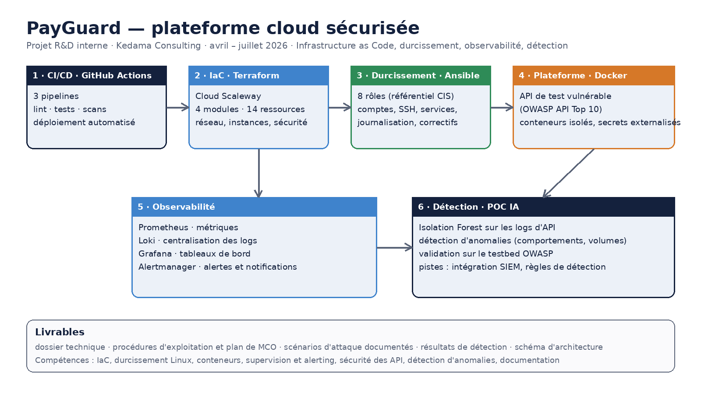

# PayGuard — plateforme cloud sécurisée (vitrine)

> Projet **R&D interne** réalisé chez **Kedama Consulting** (juin – août 2026).
> Le code source reste **privé** ; ce dépôt présente l'architecture, la démarche et les résultats.

## Objectif

Concevoir, déployer et superviser une **plateforme cloud reproductible, durcie et observable**,
servant de terrain d'expérimentation à la **sécurité des API** et à la **détection d'anomalies**.
Elle repose sur une API de test **volontairement vulnérable** (OWASP API Top 10) qui sert de cible
d'audit et de source de données pour un modèle de détection.

## Architecture & stack

| Brique | Choix | Détail |
|---|---|---|
| CI/CD | **GitHub Actions** | 3 pipelines : lint + tests, build + scan de vulnérabilités (Trivy), validation IaC |
| Infrastructure as Code | **Terraform** (Scaleway) | 4 modules réutilisables : réseau (VPC/privé/NAT), instances, base managée, sécurité |
| Durcissement | **Ansible** | 8 rôles idempotents, dont durcissement aligné **CIS** (SSH par clé, MFA bastion, fail2ban, pare-feu, correctifs auto) |
| Plateforme | **Docker** | API de test vulnérable (OWASP API Top 10), conteneurs isolés, secrets externalisés |
| Observabilité | **Prometheus · Loki · Grafana · Alertmanager** | métriques, logs centralisés, tableaux de bord, alertes corrélées aux vulnérabilités |
| Détection | **Python · scikit-learn** | POC **Isolation Forest** sur les flux de transactions |

## Résultats (mesurés)

- **Déploiement reproductible** de l'infrastructure (Terraform + Ansible) — provisionnement réel validé sur Scaleway.
- **Testbed OWASP API Top 10** : 5 vulnérabilités intentionnelles (BOLA, Mass Assignment, Excessive Data Exposure, JWT faible, absence de rate limiting) **exploitées et journalisées** — **5/5 scénarios rejoués avec succès**.
- **Détection** : POC Isolation Forest — **F1 = 0,97** (rappel 100 %) sur les scénarios de test.
- **Supervision opérationnelle** : dashboard sécurité (13 panneaux), **8 alertes** ; chaîne *exploit → alerte critique → notification → visualisation Grafana* démontrée en temps réel.
- **Qualité** : **11/11 tests** automatisés verts (dont 5 prouvant les failles) ; pipeline CI/CD vert.
- **Maîtrise des coûts** : coût **mesuré** (facturation réelle) d'une session de démonstration complète = **~0,12 €** ; stratégie d'environnement éphémère (créer → prouver → détruire).
- **Livrables** : dossier technique, procédures d'exploitation et plan de maintien en conditions opérationnelles (MCO), analyse de risques (EBIOS RM).

## Compétences mises en œuvre

Infrastructure as Code · durcissement Linux (CIS) · conteneurisation · CI/CD · supervision & alerting ·
sécurité des API (OWASP) · détection d'anomalies (machine learning) · analyse de risques · documentation technique.

## Ce que j'ai appris

- **Passer d'un déploiement manuel à une infrastructure entièrement décrite en code** (reproductible, versionnée).
- **Le durcissement n'a de valeur que s'il est vérifiable** : chaque rôle Ansible est idempotent et contrôlé.
- **Observer avant de détecter** : sans logs propres et centralisés, aucun modèle ne tient.
- **Estimer puis mesurer** : l'estimation de coûts initiale a été confrontée à la facturation réelle — le poste réseau, sous-estimé à l'intuition, s'est révélé le premier poste de coût.

## Pourquoi le code n'est pas public

PayGuard est un projet **R&D interne de Kedama Consulting** contenant des vulnérabilités
intentionnelles et une documentation d'exploitation. Par responsabilité (sécurité) et par respect de
la propriété du cabinet, **le dépôt de code reste privé** ; cette vitrine en présente l'architecture
et les résultats. Démonstration disponible sur demande en entretien.

## Contact

**Mohamed Fouad TAÏWO** 
